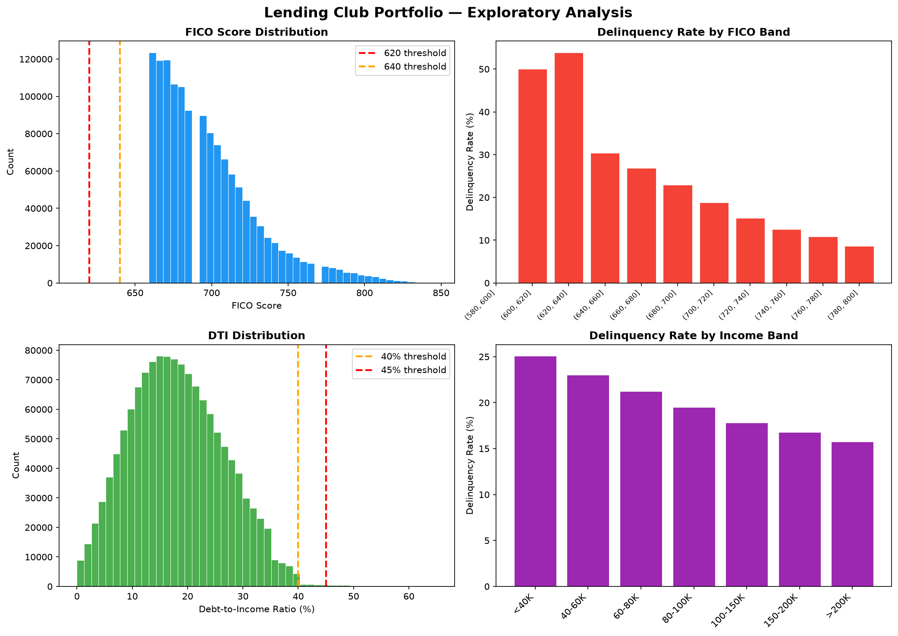
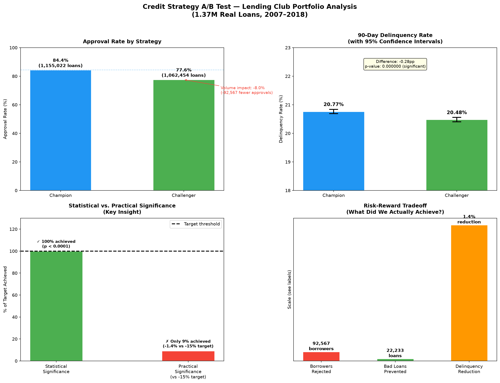

*Portfolio project by Raj Mehta — Senior Business Analyst, 
Capital One CLIP | Credit Risk Analytics*

# Credit Strategy Champion/Challenger A/B Test

## Overview
A champion/challenger credit strategy analysis using 1.37 million 
real Lending Club consumer loans (2007–2018), evaluating whether 
tightened approval criteria meaningfully reduces portfolio delinquency.

## Business Question
Does raising FICO floor (620→640), income floor ($40K→$45K), and 
tightening DTI cap (45%→40%) reduce 90-day delinquency by ≥15% 
while keeping volume impact within -10%?

## Key Finding
The challenger strategy is statistically significant (p < 0.0001) 
but practically insufficient — achieving only -1.4% delinquency 
reduction while rejecting 92,567 additional borrowers. Recommendation: 
do not scale. Redesign with more targeted segmentation.

This analysis highlights a critical distinction in large-portfolio 
credit analytics: statistical significance and practical significance 
are not the same thing.

## Results Summary
| Metric | Champion | Challenger | Impact |
|--------|----------|------------|--------|
| Approval rate | 84.4% | 77.6% | -8.0% |
| Delinquency rate | 20.77% | 20.48% | -1.4% |
| Loans analyzed | 1,155,022 | 1,062,455 | -92,567 |
| P-value | — | — | <0.0001 |
| Recommendation | — | — | DO NOT SCALE |

## Tools
Python · pandas · scipy · matplotlib · seaborn · Jupyter Notebook

## Data
Lending Club public loan dataset — 1.37M completed loans, 2007–2018
Available at: kaggle.com/datasets/wordsforthewise/lending-club

## Visualizations

### Exploratory Analysis

### A/B Test Results

## SQL Implementation

A complete SQL version of the analysis is available across 
four numbered query files, built on SQLite and compatible 
with Snowflake, PostgreSQL, and BigQuery.

| File | Purpose |
|------|---------|
| `01_exploratory_analysis.sql` | Portfolio baseline and FICO band analysis |
| `02_strategy_view.sql` | Champion/challenger strategy view definition |
| `03_ab_test_analysis.sql` | Volume, delinquency, and marginal population analysis |
| `04_final_scorecard.sql` | Complete scorecard using CTEs — single query result |

### Key SQL concepts demonstrated
- CASE WHEN for strategy logic and segmentation
- UNION ALL for side-by-side strategy comparison  
- Subqueries for percentage calculations
- CTEs (WITH clauses) for readable multi-step analysis
- Aggregate functions: COUNT, SUM, AVG, ROUND
- GROUP BY with ORDER BY for ranked analysis
